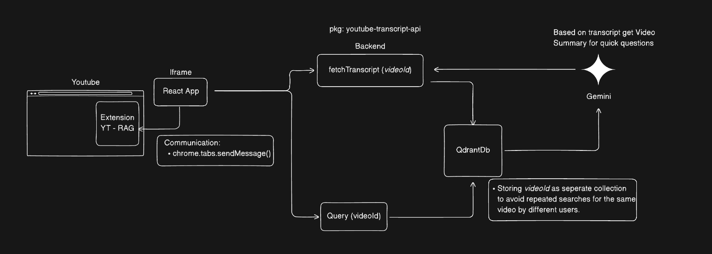
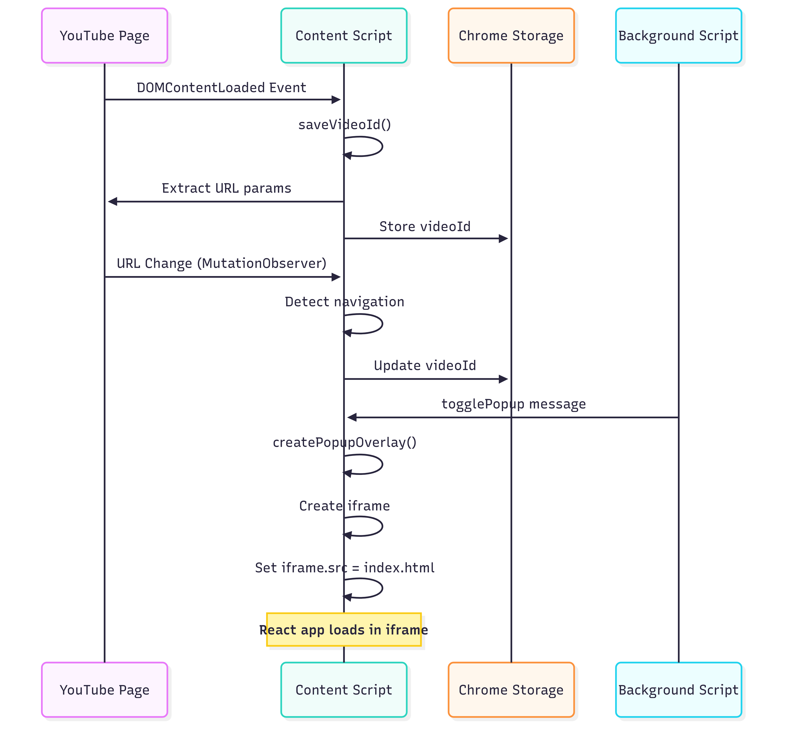
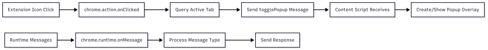
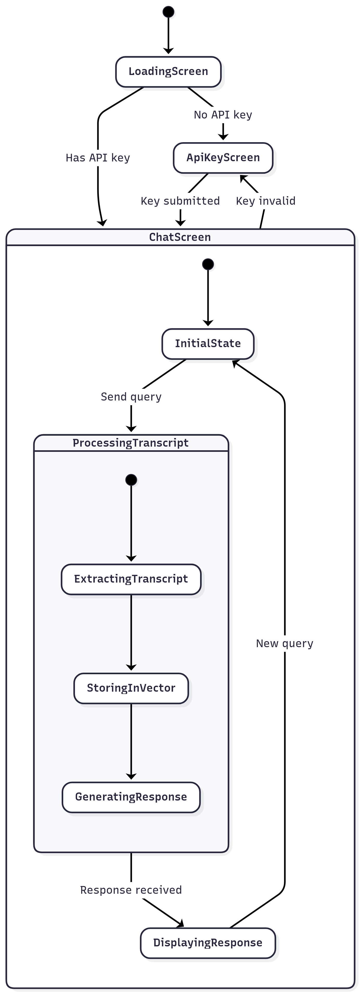
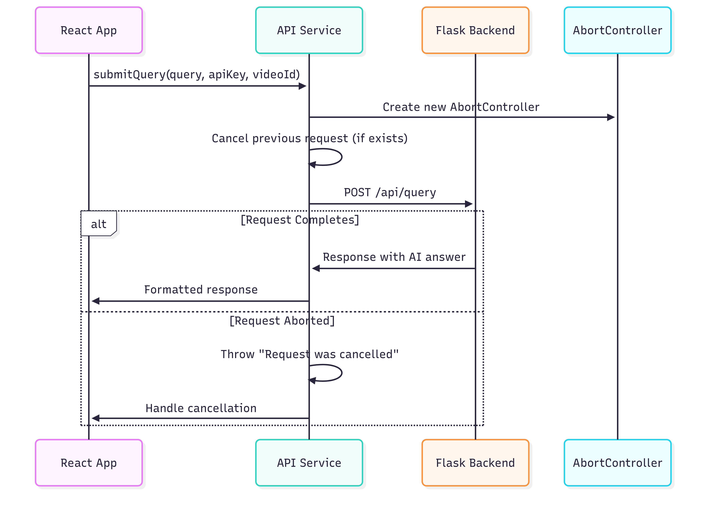
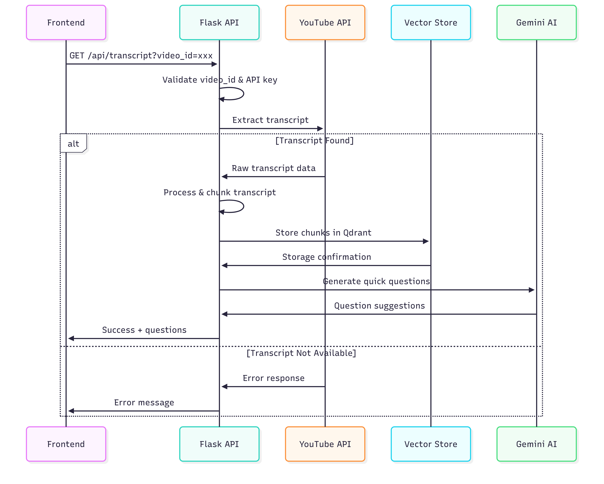
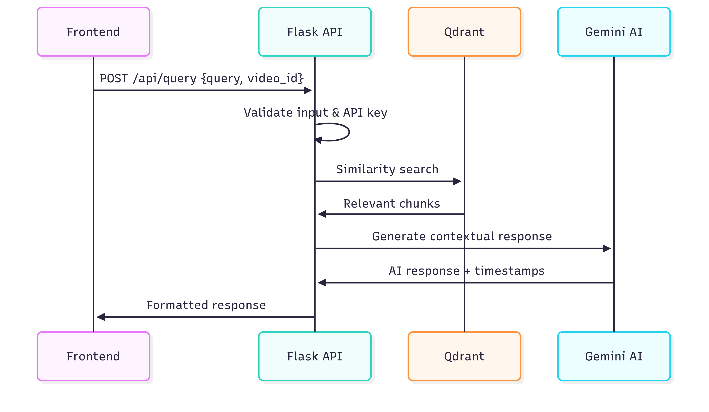
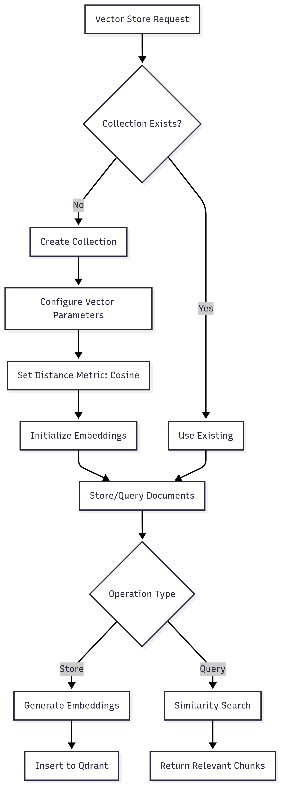
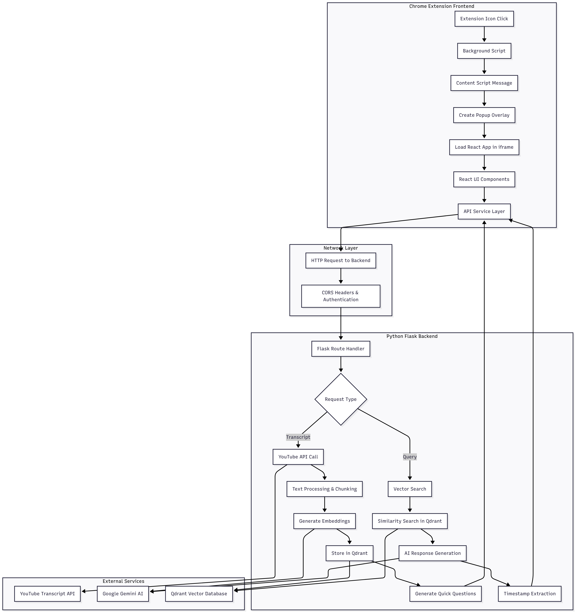

# AI Video Assistant - Technical Architecture & Flow Documentation

## System Overview

This is a Chrome extension that enables users to have AI-powered conversations with YouTube videos using a RAG (Retrieval-Augmented Generation) system. The system extracts video transcripts, processes them through vector embeddings, and provides contextual AI responses.

### **System Design Pattern**



## Architecture Components

### Frontend (Chrome Extension)

- **Manifest V3 Chrome Extension** with React UI
- **Service Worker** (background script) for extension logic
- **Content Script** for YouTube page interaction
- **React Application** for user interface
- **API Service Layer** for backend communication

### Backend (Python Flask)

- **Flask API Server** for handling requests
- **YouTube Transcript Extraction** using YouTube Transcript API
- **Vector Database** (Qdrant) for semantic search
- **AI Processing** using Google Gemini for embeddings and responses
- **RAG System** for contextual query processing

---

## Detailed Frontend Flow

### 1. Extension Initialization Flow


**Execution Order:**

1. **Background Script** (`background.js`) - Starts immediately when extension loads
2. **Content Script** (`content.js`) - Injected when user visits any webpage
3. **React App** - Loaded on-demand when user clicks extension

### 2. Content Script Detailed Flow

**File: `frontend/src/content.js`**



**Key Functions:**

1. **saveVideoId()**:

   - Extracts video ID from `window.location.search`
   - Stores in `chrome.storage.sync`
   - Triggered on page load and URL changes

2. **createPopupOverlay()**:

   - Creates fixed-position div overlay
   - Inserts iframe with React app
   - Applies styling for proper positioning

3. **Message Handling**:
   - Listens for messages from background script
   - Handles popup toggle, close, and video seeking
   - Manages communication with React app

### 3. Background Script Flow

**File: `frontend/src/background.js`**



**Responsibilities:**

- Handle extension icon clicks
- Manage communication between components
- Maintain message channel integrity
- Route messages between content script and React app

### 4. React Application Flow

**File: `frontend/src/App.jsx`**



**Component Hierarchy:**

```
App.jsx
├── LoadingScreen/
├── ApiKeyScreen/
│   ├── Input components
│   └── Validation logic
└── ChatScreen/
    ├── Chat interface
    ├── Message history
    ├── Quick questions
    └── MarkdownResponse/
        ├── Markdown rendering
        └── Timestamp links
```

### 5. API Service Layer Flow

**File: `frontend/src/services/apis.js`**



**Key Features:**

- **Request Cancellation**: Uses AbortController to cancel previous requests
- **Error Handling**: Comprehensive error management and user feedback
- **API Key Management**: Secure header-based authentication
- **Response Processing**: Formats backend responses for UI consumption

---

## Detailed Backend Flow

### 1. Flask Application Initialization

**Initialization Components:**

- Environment variables loading (API keys, URLs)
- YouTube Transcript API client setup
- CORS configuration for frontend communication
- Text splitter with optimized chunking parameters
- Qdrant vector database connection testing

### 2. Transcript Processing Flow

**Endpoint: `/api/transcript`**



**Detailed Steps:**

1. **Input Validation**:

   ```python
   video_id = request.args.get('video_id')
   api_key = request.headers.get('X-API-Key')
   # Validate both parameters exist
   ```

2. **Transcript Extraction**:

   ```python
   result = get_transcript_safely(video_id, languages, ytt_api)
   # Handles multiple language preferences
   # Manages API errors and fallbacks
   ```

3. **Document Processing**:

   ```python
   # Text splitting with overlap for context continuity
   text_splitter = RecursiveCharacterTextSplitter(
       chunk_size=2500,
       chunk_overlap=625,  # 25% overlap
   )
   ```

4. **Vector Storage**:

   ```python
   storage_success = store_documents_in_vector_db(docs, api_key, collection_name)
   # Uses video_id as collection name for isolation
   ```

5. **Quick Question Generation**:
   ```python
   quick_questions = generate_quick_questions(relevant_chunks, api_key)
   # AI-generated conversation starters
   ```

### 3. Query Processing Flow

**Endpoint: `/api/query`**



**Processing Pipeline:**

1. **Input Processing**:

   ```python
   data = request.get_json()
   user_query = data['query']
   video_id = data.get('video_id')
   collection_name = video_id  # Collection per video
   ```

2. **Semantic Search**:

   ```python
   relevant_chunks = get_relevant_transcript_chunks(
       user_query, api_key, collection_name
   )
   # Vector similarity search in Qdrant
   ```

3. **AI Response Generation**:
   ```python
   response_data = get_ai_response(user_query, relevant_chunks, api_key)
   # Contextual response with timestamp extraction
   ```

### 4. Vector Database Operations

**File: `backend/vector_store_utils.py`**



**Key Operations:**

1. **Collection Management**:

   ```python
   def ensure_collection_exists(collection_name, embedding_size=768):
       # Creates collection if doesn't exist
       # Uses video_id as collection name for isolation
   ```

2. **Embedding Generation**:

   ```python
   embeddings = GoogleGenerativeAIEmbeddings(
       model="models/embedding-001",
       google_api_key=api_key,
   )
   ```

3. **Vector Storage**:

   ```python
   vector_store.add_documents(documents=docs)
   # Stores chunked transcript with embeddings
   ```

4. **Similarity Search**:
   ```python
   vector_store.similarity_search(query=query)
   # Returns most relevant chunks for user query
   ```

### 5. AI Processing Pipeline

**File: `backend/ai_utils.py`**

**Response Generation Process:**

1. **Context Assembly**:

   ```python
   formatted_chunks = [
       f"[{chunk.metadata.get('start_time', 'Unknown')}] {chunk.page_content}"
       for chunk in relevant_chunks
   ]
   ```

2. **Prompt Engineering**:

   ```python
   prompt = f"""Based on the video transcript context: {context}
   Answer this question: {user_query}
   Include relevant timestamps in format: [MM:SS] or [HH:MM:SS]"""
   ```

3. **AI Response Processing**:
   ```python
   response = model.generate_content(prompt)
   timestamps = extract_timestamps_from_response(response.text)
   ```

---

## Complete System Flow Diagram



## Execution Timeline

### Initial Setup (Extension Installation)

1. **Background Script** starts (persistent service worker)
2. **Extension icon** becomes available
3. **Content scripts** remain dormant until page visits

### User Opens YouTube Video

1. **Content script** injected into YouTube page
2. **Video ID extracted** from URL
3. **Chrome storage updated** with current video ID
4. **MutationObserver** watches for navigation changes

### User Clicks Extension Icon

1. **Background script** receives click event
2. **Message sent** to content script on active tab
3. **Popup overlay created** (if doesn't exist)
4. **iframe created** with React app source
5. **React app initializes** inside iframe
6. **Component mounting** and state initialization

### First Query Processing

1. **React app** sends transcript request
2. **API service** makes HTTP call to backend
3. **Flask server** processes transcript extraction
4. **YouTube API** called for transcript data
5. **Text chunking** and embedding generation
6. **Vector storage** in Qdrant database
7. **Quick questions** generated by AI
8. **Response** returned to frontend

### Subsequent Queries

1. **User input** processed by React app
2. **Previous request cancelled** (if still running)
3. **New HTTP request** sent to backend
4. **Vector similarity search** in existing collection
5. **AI response generation** with context
6. **Timestamp extraction** and formatting
7. **Response displayed** in chat interface

## Error Handling & Edge Cases

### Frontend Error Handling

- **Network errors**: Retry logic and user notifications
- **Request cancellation**: Proper AbortController usage
- **Invalid API keys**: Validation and user guidance
- **Component errors**: Error boundaries and fallbacks

### Backend Error Handling

- **YouTube API failures**: Multiple language fallbacks
- **Vector database issues**: HTTP fallback mechanisms
- **AI service errors**: Graceful degradation
- **Rate limiting**: Exponential backoff strategies

### Performance Optimizations

- **Request debouncing**: Prevents rapid-fire queries
- **Vector store reuse**: Collection-per-video strategy
- **Chunking optimization**: Balanced size with overlap
- **Memory management**: Proper cleanup and disposal

This comprehensive flow ensures robust, scalable operation across all system components while maintaining excellent user experience and technical reliability.

---

## Performance Enhancements (Before vs After)

### What we changed

- Added precise timing instrumentation across the backend to identify bottlenecks.
- Skipped transcript fetch and storage when the vector collection already exists (fast count check).
- Generated quick questions using a faster model and a smaller prompt.
- Reduced similarity search work for quick questions by limiting results.

### Before (typical timings from logs)

- Transcript endpoint (`/api/transcript`):
  - Transcript list fetch: ~5.0s
  - Vector DB storage (including init): ~8.8s
  - Quick-questions similarity: ~9.9s
  - Quick-questions Gemini generation: ~19.7s
  - Total: ~45.6s

### After (expected)

- If collection exists (skip-ingest path):
  - Count check: ~1–20ms
  - Quick-questions similarity (k=2): ~0.5–2s (depends on network/Qdrant)
  - Quick-questions generation with `gemini-1.5-flash` and trimmed prompt: ~3–6s
  - Total: ~4–8s, without touching YouTube or re-storing vectors

Note: First-time videos still perform ingestion. Repeat calls benefit most from the skip-ingest path.

### Where in code

- `backend/api.py`

  - Early-exit on existing collection using `get_collection_point_count(...)`.
  - Timers added for storage, quick-questions similarity, quick-questions generation, and total endpoint time.
  - Returns timings in JSON for both `/api/transcript` and `/api/query`.

- `backend/vector_store_utils.py`

  - `get_collection_point_count(...)`: fast point count via client with HTTP fallback.
  - `get_relevant_transcript_chunks(..., k)`: allows limiting results (uses `k=2` for quick-questions).
  - Detailed timers for collection ensure, embeddings init, vector store init, similarity search, and add_documents.

- `backend/ai_utils.py`

  - Quick-questions model switched to `gemini-1.5-flash` (faster).
  - Prompt trimmed to first 2 chunks, each truncated to 800 chars.
  - Timing logs added around Gemini calls.

- `backend/youtube_utils.py`
  - Timers added for transcript list fetch, per-transcript fetch, and processing pipeline.

### What changes appear in API responses

- `/api/transcript` now includes a `timings` object. Example (skip-ingest path):

```json
{
  "success": true,
  "quick-questions": ["...", "...", "..."],
  "timings": {
    "existing_collection_count_ms": 12,
    "quick_similarity_search_ms": 740,
    "quick_question_generation_ms": 4280,
    "total_endpoint_ms": 5480,
    "skipped_ingest": true
  }
}
```

- `/api/query` includes:

```json
{
  "timings": {
    "similarity_search_ms": 2175,
    "ai_generation_ms": 14612
  }
}
```

### How to verify improvements

- Run the same video twice:
  - First run ingests transcript and stores vectors (slower).
  - Second run should log the skip-ingest path and return significantly faster with quick questions.
- Watch backend logs for ⏱️ lines and compare totals.

### Future improvements

- Use a faster model for main answers in `/api/query` (e.g., `gemini-1.5-flash`) or stream responses for better perceived latency.
- Cache vector store instances per `(api_key, collection_name)` to avoid re-initialization overhead.
- Tune Qdrant (co-location, gRPC, search params) for sub-300ms retrieval.

## Hindi → English Translation Reliability Enhancements

### Before

- **Per-entry translation**: Each small caption line was translated individually in `get_transcript_safely(...)`.
- **Blocking call**: `deep_translator` uses an internal HTTP request without an exposed timeout. If Google was slow or blocked, a single translate call could hang.
- **Cascading delay**: Many small calls could accumulate delays. When total time exceeded Gunicorn's `--timeout` (120s), the worker was killed, failing the `/api/transcript` request.

### What changed (simple)

- **Translate fewer, larger chunks**: We translate the final text chunks in `process_transcript_entries(...)` instead of every line.
- **Hard timeout per translation**: Each translate runs in a separate process with a strict timeout. If it runs long, we terminate it and move on.
- **Circuit breaker per request**: After the first timeout, we skip further translations during the same request to avoid repeated stalls.
- **Bound input size**: We cap the characters sent to the translator to keep calls fast and predictable.

### After

- One slow Google response can no longer stall the entire request.
- Fewer network calls → lower latency and fewer chances of rate limiting or SSL stalls.
- If translation is unhealthy, we gracefully fall back to the original text and still complete ingestion and quick-questions.

### Where in code

- `backend/youtube_utils.py`
  - `safe_translate_text(text, disable_flag)`: runs translation in a separate process with a hard timeout and a per-request circuit breaker.
  - `process_transcript_entries(...)`: performs translation at chunk level; greatly reduces the number of translate calls.
  - `get_transcript_safely(...)`: no longer translates per entry; preserves original text so chunk-level translation can occur.

### Configuration knobs

- `TRANSLATION_TIMEOUT_SECONDS` (default: 5): Max seconds to wait for a chunk translation.
- `MAX_TRANSLATION_CHARS` (default: 3000): Max characters sent per translate call.
- `DISABLE_TRANSLATION` (default: false): Set to `true` to bypass translation entirely (useful for debugging or constrained networks).

### Operational notes

- Local `docker-compose` mounts source (`.:/app`) and runs Gunicorn with `--reload`, so these changes hot-reload; no rebuild is needed locally. If changes aren’t reflected, restart the backend service.
- In production images (no volume mount/hot-reload), rebuild and redeploy as usual.

### Troubleshooting

- If you still encounter timeouts:
  - Lower `TRANSLATION_TIMEOUT_SECONDS` (e.g., 3) and/or `MAX_TRANSLATION_CHARS` (e.g., 800).
  - Temporarily set `DISABLE_TRANSLATION=true` to validate the rest of the pipeline.
  - Ensure network egress to Google is allowed or configure HTTP(S) proxy env vars if required by your environment.
